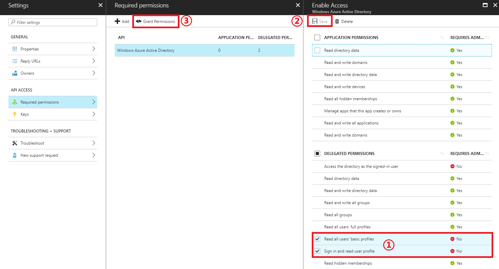

# Deploy Elastic Stack on Kubernetes in Azure Container Service (ACS)

This repository contains tools and helm charts to help deploy the [Elastck stack](https://www.elastic.co/products) on [Kubernetes](https://kubernetes.io/) in [Azure Container Service (ACS)](https://docs.microsoft.com/azure/container-service/).

## How the solution works

* Deploy a Kubernetes cluster on Azure.
* Deploy a Virtual Machine served as the Controller Node to manage and configure Kubernetes cluster on Azure.
* Register Controller Node's FQDN as the entry to Kubernetes dashbord.
* Authentication supported for Kubernetes dashbord:
    * Username / Password
    * [Azure Active Directory OAuth 2.0](https://docs.microsoft.com/en-us/azure/active-directory/develop/active-directory-protocols-oauth-code)
* Deploy a Azure Container Registry if no public registry is provided.
* Build docker images for Elastic Stack and push images to the Azure Container Register. If public registry that stores docker images for Elastic Stack is provided, this step is skipped.
* Install Elastic Stack defined as Helm Charts on Kubernetes.

## Elastic Stack on Kubernetes Architecture

## Prerequesites

* An Azure subscription. If you do not have an Azure subscription, you can sign up for a [Azure Free Trial Subscription](https://azure.microsoft.com/offers/ms-azr-0044p/)

* Login to your [Azure portal](https://portal.azure.com).

## Instructions
1. Follow tutorial [Create Azure Service Principal using Azure portal](https://docs.microsoft.com/en-us/azure/azure-resource-manager/resource-group-create-service-principal-portal) to create an Azure Service Principal and assign it `Contributor` role access to your subscription.

    * Assign application a contributor role to your subscription. The subsciption is the one where you will deploy the Elastic Stack.
    * Set the `Sign-on URL` to [http://\<dns-prefix>control.\<resource-location>.cloudapp.azure.com](#). This URL will be used to access your Kubernetes dashboard. The `dns-prefix` must be globally unique and will be used in later stages of the deployment. The `<resource-location>` is the region where you Elastic Stack deployment exists.

    > Note: not all **VM sizes** and **ACS** are supported across all regions. You can check product availabilities from [Azure products available by region](https://azure.microsoft.com/en-us/regions/services/)

    > Note: `Application ID`, `Password` and `Tenant ID` will be used in later stages of the deployment.

1. Grant your Service Principal permissions: Go to your registered app in [step 1](#create-sp)'s Settings page -> `Required permissions` -> `Windows Azure Active Directory`, tick `Read all users' basic profiles` and `Sign in and read user profile`. Click `Save` in `Enable Access` pane then `Grant Permissions` in `Required permissions` pane. Click `Yes` to confirm the action.

   

1. Set the redirect URL for your Azure Service Principal: Go to your `Service pricipal` -> `Settings` -> `Reply URLs`, add URL `http://<dns-prefix>control.<resource-location>.cloudapp.azure.com/callback` as the first redirect URL. Click `Save`.

   

1. Go to Azure Marketplace, find `Elastic Stack on Kubernetes` solution template and click `Create`.

1. In `Basics` panel, `Controller Username` and `Controller Password` need to be valid Ubuntu credential and will be used to access Kibana.
    > Password must be at least 12 characters long and contain at least one lower case, upper case, digit and special character.

    > `Resource Group` should be a new or an empty one to create your Kubernetes.

1. In `Common Settings` panel, provide the following:
   * `Dns prefix` - The DNS name prefix of your Kubernetes controller. It should be the same as the `dns prefix` you specified in your Azure Service Principal.

   * `Registry url`- The URL of a public registry that will host `elasticsearch `, `kibana` and `logstash` docker images. If this field is empty, the solution will automatically create an Azure Container Registry instance.
   * `Event hub namespace` - e.g. "myeventhub".
   * `Event hub key name` - event hub `SETTINGS` find `Shared access policies` e.g. "RootManageSharedAccessKey".
   * `Event hub key value` - SAS policy key value.
   * `List of event hubs` - event hub `ENTITIES` find `Event Hubs` and list the event hubs from which you'd pull events e.g. "insights-logs-networksecuritygroupevent,insights-logs-networksecuritygrouprulecounter". Event hubs in the list must be existed and are comma seperated.
   * `Event hub partition count` - partition count of event hubs (all listed event hubs must have the same partition count).
   * `Thread wait interval(s)` - logstash event hub plugin thread wait interval in seconds.

    > If the logstash get logs from log shipper instead of Azure Event hub, keep the `Event hub namespace`/`key name`/`key value` as `undefined`.

    > The Event hub namespace, key name, key value and event hubs can format the event hub's connection string: `Endpoint=sb://<namespace>.servicebus.windows.net/;SharedAccessKeyName=<key-name>;SharedAccessKey=<key-value>;EntityPath=<eventhub-name>`. The key should be given access with `listen`.

    > If you are pulling events out of various event hubs with different partition counts, you are advised to deploy multiple instances of the solution.

   * `Data node storage account sku` - storage account sku used by Elasticsearch data node.
   * `Authentication Mode` - authentication mode for accessing Kubernetes dashboard.
      * `Basic Authentication` mode uses `Controller Username` and `Controller Password`.
      * `Azure Active Directory` mode uses Azure AD service principal for authentication. You need to provide your service principal information which you get at [Step 1](#create-sp):

        * `Azure AD client ID` - [Application ID](https://docs.microsoft.com/en-us/azure/azure-resource-manager/resource-group-create-service-principal-portal#get-application-id-and-authentication-key)
        * `Azure AD client secret` - [Your generated key](https://docs.microsoft.com/en-us/azure/azure-resource-manager/resource-group-create-service-principal-portal#get-application-id-and-authentication-key)
        * `Azure AD tenant` - [Tenant ID](https://docs.microsoft.com/en-us/azure/azure-resource-manager/resource-group-create-service-principal-portal#get-tenant-id)

1. In `Kubernetes Cluster Settings` panel, provide the following:
     * `Agent Count` - number of agent nodes of Kubernetes cluster
     * `Agent Node Size`
     * `Master Count` - number of masters of Kubernetes cluster

1. In `Security Settings` panel, provide the following:
     * `SSH public key` - ssh public key for controller node to talk to Kubernetes cluster
     * `Base64 encoded SSH private key` - base64 encoded ssh private key

      > You can generate the SSH public key/private key pair using [js-keygen](https://microsoft.github.io/elk-acs-kubernetes/)

     * `Service principal client ID` - Application ID
     * `Service principal client secret` - Your generated key

      > The `Sercive principal client ID` and `Service principal client secret` are used to create and manage the Kubernetes cluster, they can be the client id and secret you get from [Step 1](#create-sp). Ensure the Service principal used here has contributor access to your subscription and in the same AAD tenant as your subscription.

1. Click OK in Summary panel and create the solution.

> The creation may cost around half an hour.

## Acccess your Elastic Stack on Kubernetes

After the deployment succeeds, you can find the Kubernetes dashboard and kibana/elasticsearch/logstash endpoints
* You can access your Kubernetes dashboard at:
  [http://\<dns-prefix>control.\<resource-location>.cloudapp.azure.com/api/v1/proxy/namespaces/kube-system/services/kubernetes-dashboard/#!/overview?namespace=elk-cluster-ns](#)

  The namespace is `elk-cluster-ns`.

* Find kibana/logstash endpoints at `Discovery and Load Balancing` -> `Services` on your Kubernetes dashboard.

  > kibana dashboard's credential is the same as controller you specified in Basic Setting.

* To manage the Kubernetes cluster, you can use `kubectl` on controllervm.

  > The SSH credential is the same specified in Basic Setting.

## How the logs are consumed by your Elastic Stack

The solution supports two ways to ship logs to Elastic Stack:
* Ingest logs from event hub(s) by logstash input plugin for data from Event Hubs.
* Log shippers e.g. [Filebeat](https://www.elastic.co/products/beats/filebeat)

## Troubleshooting

* For resource deployment failure, you can find more information from Azure Portal.
* For solution template failure, you can extract logs by ssh to `controllervm`. Deployment log is at `/tmp/output.log`.

## Related

* [Access kubernetes using web UI (dashboard)](https://kubernetes.io/docs/tasks/access-application-cluster/web-ui-dashboard/)
* [Manage Kubernetes using kubectl](https://kubernetes.io/docs/reference/kubectl/overview/)
* [Scale agent nodes in a Container Service cluster](https://docs.microsoft.com/en-us/azure/container-service/dcos-swarm/container-service-scale)
* [Communication between Kubernetes master and node](https://kubernetes.io/docs/concepts/architecture/master-node-communication/)
* [Ship log to logstash using log shipper filebeat](https://www.elastic.co/guide/en/beats/filebeat/current/filebeat-getting-started.html)
* [Azure Event Hubs](https://docs.microsoft.com/en-us/azure/event-hubs/event-hubs-features)
* [Stream Azure Diagnostic Logs to an Event Hubs Namespace](https://docs.microsoft.com/en-us/azure/monitoring-and-diagnostics/monitoring-stream-diagnostic-logs-to-event-hubs)

## License

  This project is under MIT license.

  `config/openidc.lua` is derived from [https://github.com/pingidentity/lua-resty-openidc](https://github.com/pingidentity/lua-resty-openidc) with some modifications to satisfy requirements and this file (`config/openidc.lua`) is under Apache 2.0 license.
